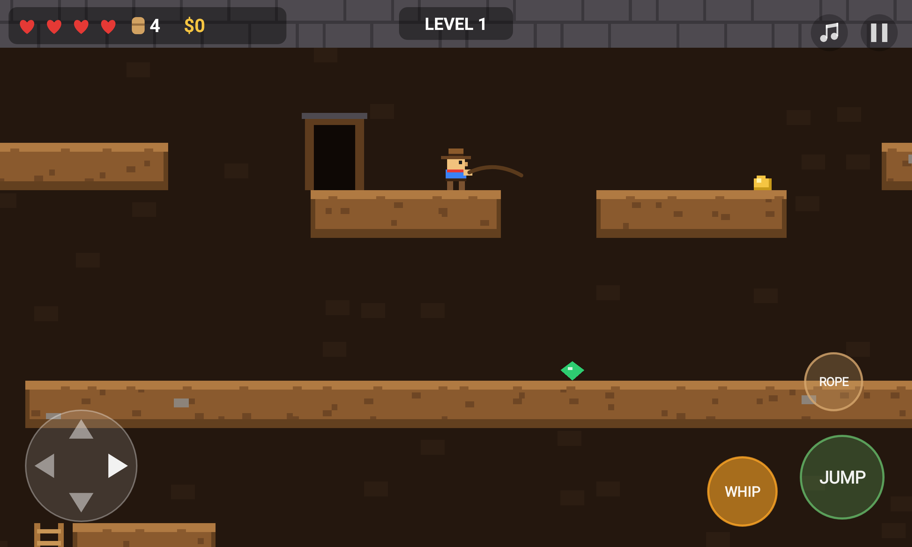

# Spelucky

A Spelunky-style cave explorer for Android tablets, written in plain Kotlin with no game
engine and no image files. Everything is drawn with simple shapes and the sound effects
are synthesized when the app starts.



## Playing

- **Left half of the screen** is a d-pad: put your thumb anywhere there and slide.
  ◀ ▶ run, ▲ ▼ climb ladders and ropes, ▲ in front of the **EXIT** door goes to the next level.
- **JUMP**: hold longer to jump higher. Jump toward a wall to **grab the ledge**, then jump again to climb up.
- **WHIP** kills snakes and bats. You can also jump on their heads.
- **ROPE** throws a rope straight up. Climb it to reach high places (you start with 4).
- You have 4 hearts. Falling onto spikes is deadly, and very long falls hurt.
  When you die, the run starts over from level 1 with a brand-new random cave.

The ♪ button in the top-right corner turns the music on or off.

**Online leaderboard:** when a run ends, the loot and level are sent to
[scores.walczaki.com](https://scores.walczaki.com) (backend: [mwalczak/mobile-scores](https://github.com/mwalczak/mobile-scores)).
The first time, the game asks for a nickname; tap "Playing as ..." on the title screen to change it.
Scores made without internet are kept and sent later. The leaderboard only appears in builds made
with the `SCORES_KEY` repository secret (the key for `spelucky` in mobile-scores' `GAME_KEYS`).

A keyboard or Bluetooth game controller also works (arrows/WASD, Space/Z jump, X whip, C rope, P pause, M music).

## Installing on the tablet

Every push to `main` is built by GitHub Actions and published as a
[GitHub Release](../../releases/latest). On the tablet, open the latest release, download
`spelucky.apk` and open it. Android will ask to allow installs from the browser once.
Newer builds install over older ones, and saved records are kept.

Builds from other branches are attached to their workflow run under **Actions** as `spelucky-apk`.

## Working on the code

Open the folder in **Android Studio** and press Run, or use the command line:

```sh
./gradlew assembleDebug        # APK in app/build/outputs/apk/debug/
./gradlew testDebugUnitTest    # level generator and physics tests
```

| File | What it does |
| --- | --- |
| `game/LevelGenerator.kt` | Random levels: a 4×4 grid of rooms built from templates, with a guaranteed path to the exit. Edit the room templates here. |
| `game/Player.kt` | Movement, jumping, ladders, ledge grabbing, whip. Tweak speeds and jump height at the top. |
| `game/Actors.kt` | Snakes, bats, treasure. |
| `game/Game.kt` | Game rules: damage, collecting, ropes, levels, game over. |
| `ui/Renderer.kt` | All drawing, including colors and sprites. |
| `ui/LeaderboardClient.kt` | Sends scores to the online leaderboard and loads the top 8. |
| `ui/TouchControls.kt` | On-screen buttons and their layout. |
| `ui/SfxSynth.kt` | The sound effects (coin, gem, whip, hurt, death, ...). Each one is a few lines of tones and noise. |
| `ui/MusicSynth.kt` | The background music. The tune is written as note names (`"A4:2 C5:2 ..."`), so it is easy to change. |

The `game` package has no Android code, so it's covered by fast JVM unit tests in `app/src/test`.
`LevelGeneratorTest` checks that hundreds of random levels can all be finished.

The APK is signed with `app/debug.keystore`, a debug key committed on purpose so
builds from GitHub and from your own computer can update each other on the tablet.
It isn't suitable for publishing on Google Play.
